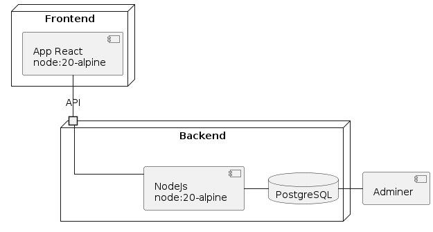
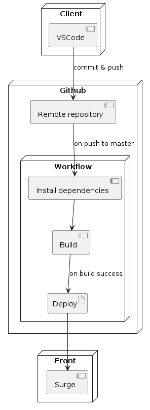

# Correction parcours

## Schéma d'architecture

## Schéma de déploiement

# Bilan de l'atelier :

### Ce qu'on aurait pu être fait différement 

 Nous avons utilisé le `localstorage` pour stocker le token lors de l'authentification, avec du recul, cela aurait été plus pertinent d'utiliser le `Context` de React.

### Ce qu'on aurait fait avec plus de temps

Nous aurions aimé prendre le temps de refactoriser le code (notamment la gestion des erreurs 500).

Factoriser le CSS pour une meilleure utilisation des fonction scss (notamment les mixins).

Terminer l'implémentation du `create wizard`.

Changement de l'icon à l'authentification et positionnement du footer.

Ré organiser l'arborescence des dossiers.

### Points de blocage 
- la double authentification : blocage dû à la non utilisation du `Context` et à des comportements imprévus et non justifiés de React 

### Points de satisfaction
- malgré blocage sur l'authentification, expérience enrichissante car nous avons travailler en pair-programming pour arriver au bout de cette fonctionnalité

- bonne répartition des autres tâches pour éviter perte de temps et conflits github

- le projet nous a permis de mieux comprendre certaines fonctionnalités de React